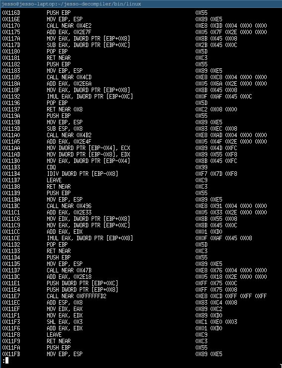

# Jesso Decompiler: A C decompiler for Windows and Linux
The Jesso Decompiler is a tool that will generate readable C code from a compiled binary. It can either read from a file, or parse a given string
of bytes. The command line interface for Linux will handle reading from an ELF binary, and the Windows graphical user interface will handle reading a
portable executable file. All bytes must be in x86-64 machine code, and when generating assembly output, it will be in Intel style syntax. The GUI for Windows
is made using wxWidgets (https://wxwidgets.org). 

# Installation
If you do not want to compile it yourself, there are precompiled binaries already in bin. "JessoDecompiler.exe" is the GUI application for windows, and "jdc" is 
the CLI for linux.

Assuming you have git, gcc, and make installed, you can compile the Jesso Decompiler yourself on Linux.
Just clone the git repository, cd into it, and then run "make jdc". This will compile the CLI and place it in bin/linux
```bash

git clone https://github.com/Jesso4906/jesso-decompiler.git
cd jesso-decompiler
make jdc

```

# CLI Usage
If you run the CLI with the -h or --help flag, you will get a list of flags that can be used with the Jesso Decompiler.
```
./jdc -h

```
# Disassembling
If you only want to disassemlble, you can do using the -da or --disassemble flag.
By default, it will accept a file path as the final argument. If you want to disassemble a literal string of bytes, you can do so with the -s flag.
```bash

# if the file is 32-bit or you want jdc to interpret a string of bytes as x86 machine code, use the -x86 flag.
./jdc -da -x86 ./test32 # disassembling a 32-bit elf binary
./jdc -da -s 55 # disassemble the byte 0x55

```
When disassembling a file, the program will look for the ".text" section and read the bytes from there. Same applies when decompiling.



# Decompiling
To use the decompiler, run jdc with the -dc or --decompile flag.
```bash

./jdc -dc -x86 ./test32 # decompiling a 32-bit elf binary

```
This will then prompt for further input. Use h for help.
To list all functions that jdc identified, use l.
To decompile a function, use s. Then, enter the index of the function when prompted. Listing all the functions with l will show each functions's index.
