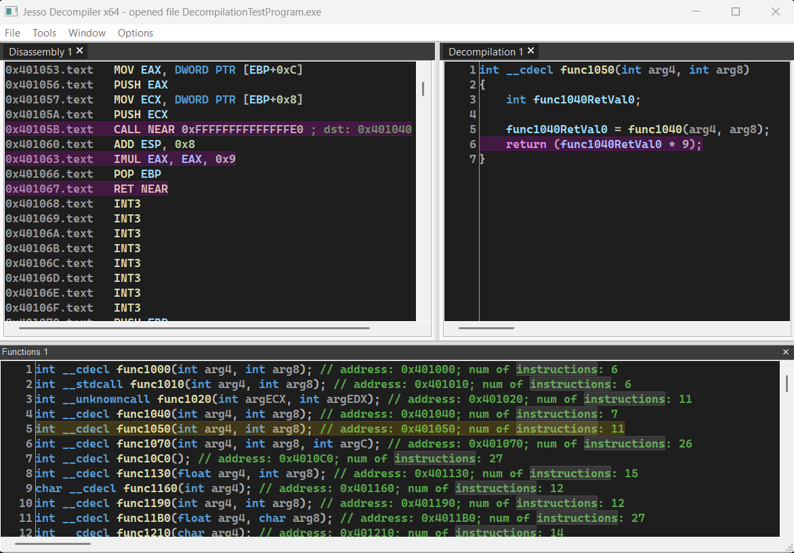

# Jesso Decompiler: A C decompiler for Windows and Linux
Jesso Decompiler is a static file analyzer. It has a disassembler, C decompiler, and other file analysis tools. JDC handles ELF and PE
file formats, and x86/x86-64 machine instructions.

The GUI is made using [wxWidgets](https://wxwidgets.org).

The decompiler is still a work in progress, and the disassembler is not yet fully comprehensive of the Intel instruction set.



# Installation
If you do not want to compile it yourself, there are binaries already in bin. 

On Linux, you may need to install the wxWidgets GTK library to run JDC. You can do that with this command if you are on a Debian system.
```bash
sudo apt install libwxgtk3.2-1
```
## Compiling
### Linux
To compile the GUI on Linux you will need gcc, g++, and make. 
You will also need to install [wxWidgets verison 3.2.10](https://github.com/wxWidgets/wxWidgets/releases/tag/v3.2.10) and configure it. The Makefile for JDC assumes that the path to wx-config is: 
```
"../wxWidgets-3.2.10/gtk-build/wx-config"
```

You will have to update the Makefile if you do not have the same path. After cloning this repository, use "make jdc-gui" to build JDC.
```bash
git clone https://github.com/bfjesso/jesso-decompiler.git
cd jesso-decompiler
make jdc-gui
```

### Windows
You can use the Visual Studio project included in this repository to build JDC. You will need to have a build of wxWidgets 3.2.10, 
and the JDC project expects an environment variable called "WXWIN" to be defined as the location of the folder containing the wxWidgets 
"include" and "lib" folders.

# How it works
Jesso Decompiler works by taking a binary, gathering information from the file data, disassembling the code bytes, and then analyzing the
disassembled instructions.

## File handling

JDC handles ELF files and PE files. Regardless of which format, JDC does the following:
1. Determine if the file executes x86 or x64 instructions
2. Read the whole file's bytes
3. Get the image base, entry point, section headers, and import info

If JDC is unable to identify the file format, it can still be loaded. In this case, the user specifies an entry point and the whole file is
disassembled. A dummy ".text" section is created that contains the whole file. 

## Disassembling

The disassembler works by reversing Intel's instruction encoding system. [Here is their developer manual.](https://www.intel.com/content/www/us/en/developer/articles/technical/intel-sdm.html)
First the prefixes are handled. This includes the legacy prefixes, REX prefix, VEX prefix, and EVEX prefix. Then the opcode is handled.
I copied the opcode maps from the manual into arrays, where the opcode byte is the index. I used 2D-arrays for the maps where a prefix is 
used to encode other opcodes. The way I handle operands is with the abbreviations that Intel uses in their opcode maps. Their meanings 
can be found in the manual.

## Decompilation

JDC first analyzes all the disassembled instructions. All function information is identified. This includes the begining and end of 
all the functions, their arguments, return values, stack variables, and conditions. When a function is decompiled, JDC goes through every 
instruction in the function and checks for the beginging/end of any condition, return statements, assignemnts to memory/local variables, 
function calls, and intrinsics. Each one of these has a seperate routine to decompile them.
