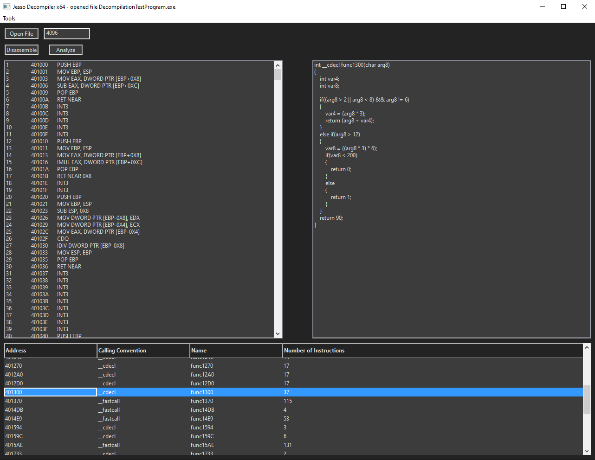

# Jesso Decompiler: A C decompiler for Windows and Linux
Jesso Decompiler is a static file analyzer that disassembles and generates C code from a compiled binary. On Windows, JDC will handle 
portable executable files, and on Linux, it will handle ELF files. All binaries must be in x86/x86-64 machine code. 
The GUI is made using [wxWidgets](https://wxwidgets.org).

The decompiler is still a work in progress, and the disassembler is not yet fully comprehensive of the Intel instruction set.



# Installation
If you do not want to compile it yourself, there are precompiled binaries already in bin.

## Linux
To compile the GUI on Linux you will need gcc, g++, and make. You will also need to get and build wxWidget's source. Once you clone jesso-decompiler,
you will have to update the Makefile with the path to wx-config. After that just run "make jdc-gui" to build it.
```bash

git clone https://github.com/bfjesso/jesso-decompiler.git
cd jesso-decompiler
make jdc-gui

```

## Windows
You can use the Visual Studio project included in this repository to build JDC. You will also need to have wxWidgets installed.

# How it works
Jesso Decompiler works by taking a binary, gathering information from the file data, disassembling the code bytes, and then analyzing the
disassembled instructions.

## File handling

Depending on if you run the Windows or Linux build of JDC, it will either handle PE (portable executable) files, or ELF (executable and linkable format)
files. Either way, what JDC does is essentially the same:
1. Find import information, including function names and addresses
2. Get bytes from all sections with executable instructions (like ".text")
3. Get bytes from all section with data for resolving constants in decompiler

## Disassembling

Disassembling works by reversing Intel's instruction encoding system. The disassembler in JDC was made by refferencing Intel's developer manual, which
can be found [here](https://www.intel.com/content/www/us/en/developer/articles/technical/intel-sdm.html). Right now, the disassembler is not entirely
complete with all opcodes.

## Decompilation

Before decompiling a function, JDC needs to analyze all the disassembled instructions. This means indentifying the begining and end of all functions,
and loading bytes from the file's data section that will be used to resolve constants to values.

When decompiling a function, the first thing JDC does is look for all conditions within the function. This means identifying if statements and loops by
look for conditional jumps (Jcc). After this, JDC goes through every instruction in the function and checks for the beginging/end of a condition,
a return statement, an assignemnt to memory or variables, or a function call. Each one of these has a seperate routine to decompile them.
